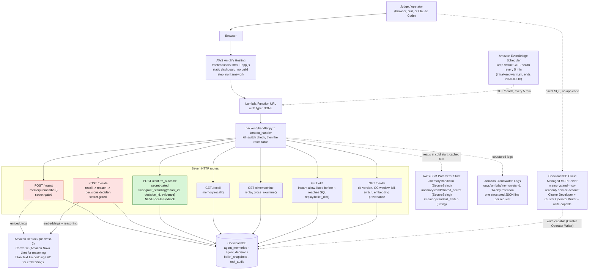
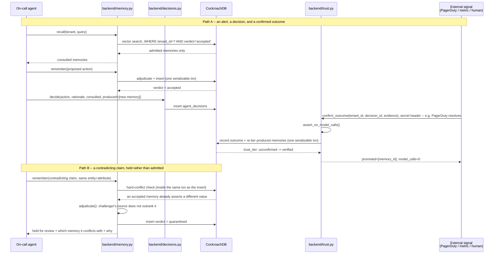

# Architecture

This is the document to read after the README. The README makes the pitch and states what
is and is not novel; this document is how the system is actually built, why each piece is
shaped the way it is, and what was measured rather than assumed.

## System overview



The one thing this diagram exists to make visually obvious: `/ingest` and `/decide` (pink) are
the only routes wired to Bedrock. `/confirm_outcome` (green) is not merely "usually" model-free
-- `backend/trust.py` imports no model client at all, and `assert_no_model_calls()` checks that
structurally at the top of every `grant_standing()` call. That is the product's one novel claim,
enforced in code a judge can read, not asserted in a docstring.

Two things worth calling out that a first read of the diagram will not show. First, this
counts **seven** HTTP routes, not the six `memorystand` CLI subcommands (`remember`, `recall`,
`decide`, `confirm`, `cross-examine`, `audit`) -- `/health` has no CLI equivalent, and `audit`
has no HTTP route at all, on purpose (see `backend/audit.py`'s own docstring: the audit trail is
meant to be read with the same MCP credential used everywhere else, including through the
Managed MCP Server -- see "MCP: what the credential actually grants" below for why that
credential is not read-only -- with no application code in the path). Second, the MCP server and `ccloud`
CLI are both real CockroachDB tooling used here, but neither is a runtime dependency of the
request path above -- MCP is a parallel, judge-facing path directly into CockroachDB (used here
only to read, over a credential that is not actually restricted to reading -- see the next
section), and `ccloud` (`infra/provision.sh`) is a provisioning-time tool, not something the
Lambda calls.

### MCP: what the credential actually grants

The service account is `memorystand-mcp-readonly`
(`a7f75cdd-04fb-4e66-889b-a1216e15f57d`), and the name is aspirational, not accurate. It
originally held only `CLUSTER_DEVELOPER`, under which `select_query` returned "executing select
query: unauthorized". Getting the MCP server working at all required also granting
`CLUSTER_OPERATOR_WRITER` (displayed in the console as Cluster Developer / Cluster Operator) --
Cockroach Labs' own docs require "the Cluster Admin role or the Cluster Operator role" for this
server, and there is no read-only role that works with it. A genuinely read-only MCP identity is
therefore not achievable against the managed server as it exists today; this identity is
write-capable, full stop.

Verified live with that role: the handshake to `https://cockroachlabs.cloud/mcp` returns
`serverInfo {name: "cockroachdb-cloud", version: "1.0.0"}`; `select_query` returns
`{"rows":[{"trust_tier":"unconfirmed","memories":118},{"trust_tier":"verified","memories":5}]}`;
`explain_query` shows `vector search: True`. The string `mcp:read` does not appear in any script
or config here -- it was never a real CockroachDB Cloud role, and every prior reference to it in
this repo's docs was wrong.

Tool availability is not permission: the MCP server offers `create_database`, `create_table`, and
`insert_rows` to every identity regardless of role, including the one used here. `scripts/verify_mcp.py`
automates the checks above; its write probe is opt-in behind `--probe-writes` and has not been
run, so whether a write would actually be accepted or refused is untested, not "refused" -- that
distinction matters and this document will not round it up. Two argument-naming traps worth
recording since they produce a misleading error rather than an obvious one: `select_query` and
`explain_query` take a `"query"` argument (not `"statement"`), and `create_table` takes a raw
`"ddl"` string; getting the argument name wrong returns "must contain exactly one statement",
which reads like a SQL problem and is not one.

## Memory lifecycle



Path A is the whole pitch end to end: recall never sees anything but admitted memories, the
decision records exactly what it consulted versus what it produced, and the only thing allowed
to move a memory's trust tier is a real external signal, checked with zero model calls -- proved
structurally, not by convention.

Path B is what keeps Path A honest: a lower- or equal-authority contradiction is held, not
silently accepted and not silently dropped, and it is held *inside* the same serializable
transaction as the conflict check (see "adjudicate outside, decide inside" below) so a second
writer racing the same entity+attribute cannot slip past the check between it and the insert.

## The data model

**`agent_memories`** is the one memory table -- there is no separate accepted/quarantine split.
Every memory an agent writes lands here with a `verdict` (`accepted`, `quarantined`, or
`superseded`) deciding whether it is recallable at all, and independently a `trust_tier`
(`unconfirmed`, `verified`, or `disputed`) recording whether reality has since backed it up.
Nothing is ever deleted: a corrected fact gets a new row whose `supersedes` column points at the
old one, and the old row's `verdict` flips to `superseded` in the same transaction. That is
deliberate -- CockroachDB's own MVCC history over this single table is the entire audit trail
`AS OF SYSTEM TIME` needs, with no bitemporal bookkeeping, no triggers, and no second store.

**`agent_decisions`** is what the agent actually did, with two separate id lists:
`consulted_memory_ids` (what recall handed it) and `produced_memory_ids` (what the decision
itself wrote back). Only produced memories are re-tiered when an outcome comes in -- a memory
that was merely consulted is not promoted just because the action worked, and not demoted just
because it didn't, because a correct fact can be consulted by a bad plan. `requires_approval`
with a NULL `approved_by` is a decision recorded but not taken -- a held action, not a hidden one.

**`belief_snapshots`** is a tamper-evident checkpoint, not a durability mechanism: a scheduled
job (`backend/snapshots.py`) takes a SHA-256 digest of the admitted-memory set at an instant, and
`verify()` later re-derives that instant with `AS OF SYSTEM TIME` and compares digests. It stores
identifiers and a hash, not content, and it says so plainly when a check falls outside the GC
window (`verdict: unverifiable`) rather than pretending durability it does not have.

**`tool_audit`** is every governed call as a queryable SQL table, with native row-level TTL
(`ttl_expire_after = '180 days'`) bounding its own growth -- no cron sweep to forget to run.
Living in the same database as the memories means a judge can read it with the same MCP
credential used for everything else, including through the Managed MCP Server, with zero
application code in that path -- that credential is write-capable rather than read-only (see
"MCP: what the credential actually grants" above), but nothing in this project's own code path
uses it to write.

### Why the vector index prefix is `(tenant_id, verdict, embedding)`

The DDL is `VECTOR INDEX agent_memories_tenant_idx (tenant_id, verdict, embedding
vector_cosine_ops)`. `verdict` sits in the prefix deliberately, and it was not the first thing
tried. `recall()`'s query filters `WHERE tenant_id = ? AND verdict = 'accepted'`, and a
`(tenant_id, embedding)`-only prefix cannot satisfy that second equality predicate from inside
the index, so CockroachDB's optimizer abandoned the index entirely. Measured at 4,000 rows on
this CockroachDB v26.2.5 cluster (`SPIKE-RESULTS.md`, spike 1):

| Index prefix | Resulting plan |
|---|---|
| `(tenant_id, embedding)` | `scan agent_memories@..._pkey` -- vector index unused |
| `(tenant_id, verdict, embedding)` | `vector search` + `prefix spans` -- correct |

Re-verified live in this session against the ~104-row seeded tenant, after `ANALYZE`:

```
• vector search
      table: agent_memories@agent_memories_tenant_idx
      target count: 5
      prefix spans: [/'9c8f6e5a-9d1a-4a1c-8f2e-3b6d1c7a4e10'/'accepted' - /'9c8f6e5a-9d1a-4a1c-8f2e-3b6d1c7a4e10'/'accepted']
```

This is also a correctness win, not just a performance one: because `verdict` is physically part
of the ANN partition key, the searched partition for a given tenant *is* "admitted memories of
that tenant". A held or superseded memory is not filtered out of the results after the fact --
it was never in the partition being searched. See "What we measured" below for a scale at which
this stops being the whole story.

## Design decisions and their costs

**One memory table instead of an accepted/quarantine split.** Cost: every reader must remember
to filter `verdict = 'accepted'` (asserted and re-checked in `memory.recall()` itself, since a
leak here would falsify the product's central claim). Benefit: the table's own MVCC history is
the audit trail, with nothing extra to keep in sync.

**Adjudicate outside the transaction, decide inside it.** Embedding a memory and, on `/decide`,
asking Bedrock to reason are both slow, non-transactional, and wrong to do while holding a
SERIALIZABLE transaction open. But moving the whole admission check outside the transaction opens
a TOCTOU hole: the neighbour set can change between the check and the commit. The fix in
`backend/memory.py` is to do the expensive work first, then re-run the deterministic
conflict/neighbour query *inside* the transaction that performs the insert -- so a concurrent
conflicting write forces a real SQLSTATE 40001 and the retry re-decides against fresh state.
Cost: every write pays for a second, cheap read of the same conflict/neighbour query. Benefit:
`scripts/race_demo.py`'s Part 2 (two concurrent contradictory `remember()` calls) resolves to
exactly one accepted and one quarantined memory, every time, not "usually".

**Supersede rather than delete.** Cost: `agent_memories` has no delete path and no TTL (unlike
`tool_audit`'s 180-day row-level TTL), so it grows monotonically with every correction as well as
every new fact -- there is no compaction or archival story yet. Benefit: a provenance chain
`AS OF SYSTEM TIME` can walk with no separate history table, and "corrected by" instead of
"gone" matches how an on-call team actually thinks about a fact that turned out to be wrong.

**`verdict` and `trust_tier` as two independent axes.** `verdict` is a write-time answer to "is
this recallable at all"; `trust_tier` is a later answer to "has reality since confirmed it".
Conflating them would make the outcome gate unable to distinguish "never checked" from "checked
and wrong" -- both would just be "not verified". Cost: two enum columns and two separate state
machines to reason about instead of one.

**The promotion path is model-free by construction, not by convention.** `backend/trust.py`'s
entire import list is `typing`, `psycopg2.extras`, and `. db` -- no `boto3`, no `embeddings`, no
model client reachable from that module's namespace at all. `assert_no_model_calls()` checks that
set on every live call, not just in a test nobody runs. Cost: the outcome gate cannot use a model
to sanity-check ambiguous evidence, so `trust.OutcomeRejected` is deliberately strict instead
(a required `external_ref`, a fixed `source` enum, `metric_delta` mandatory when `source=metric`).

**The kill switch and the shared secret are both asymmetric on purpose.** The kill switch blocks
`/ingest`, `/decide`, and `/confirm_outcome` but never the four read routes -- "I have no memory
right now" degrades toward "reads still work", never toward "writes silently vanish". The shared
secret gates all three write routes. It originally gated only the two Bedrock-calling ones
(`/ingest`, `/decide`), on the reasoning that those spend real money and quota on every call --
which left `/confirm_outcome`, the route that *grants trust*, open to anyone holding a decision
id. Gate by what a route changes, not by what it costs; a test now asserts every `POST` route is
gated, so the next one cannot be classified by feel. The read routes stay open so a judge can
poke them from a browser without being handed a secret first. Cost, stated in Known Limits below: those four read routes
are unauthenticated by design.

**Lambda reserved concurrency is capped at 15** (`infra/deploy.sh`), specifically because
CockroachDB Basic tolerates roughly 25 concurrent connections and this project's pool is one
connection per warm container -- the cap leaves headroom for the CLI and the MCP server on the
same cluster rather than trusting Lambda's account-wide 1000-execution limit to behave.

## What we measured

**Retrieval latency** (`benchmarks/results.md`, `python scripts/loadtest.py --rows 10000
--tenants 50`, single local CockroachDB v26.2.5 node): the vector-indexed table served p50
2.38ms / p99 2.91ms versus 23.61ms / 35.36ms for an identical brute-force control -- 9.92x
faster at p50, 12.14x at p99, at 10,000 rows across 50 tenants. Write throughput during
seeding: 2,623 rows/sec indexed versus 6,751 unindexed. That report also records a more nuanced, honestly-reported finding:
at that row count, `backend.memory.recall()`'s exact compound predicate did not always make the
optimizer choose `vector search` over two other B-tree indexes already on the table
(`agent_memories_recallable_idx`, `agent_memories_attr_idx`); an isolated single-index table
confirmed the ANN mechanism itself is real and selected when nothing else competes for the same
predicate. Freshly re-run in this session against the live cluster's ~104-row seeded tenant,
`vector search` and `prefix spans` were both present (quoted above) -- so index selection here is
real but genuinely scale- and index-competition-dependent, not a settled constant. Reproduce with
`python scripts/loadtest.py`.

**Concurrency** (`benchmarks/concurrency.md`, `python scripts/race_demo.py --writers 10`,
regenerated by `scripts/demo.sh` every run): 10 concurrent processes racing a read-modify-write
on one row landed all 10 updates with 0 lost updates and real, live-captured SQLSTATE 40001
retries -- not a mocked exception. Two concurrent agents submitting contradictory memories for
the same tenant/entity/attribute resolved to exactly one `accepted` and one `quarantined` row,
independently re-read from the table rather than trusted from the workers' own reports.

## Known limits

Written plainly, because a memory system that overstates itself is the exact failure mode this
project exists to prevent.

- **Admission control is a filter, not a truth oracle.** A false claim that contradicts nothing
  already admitted is still admitted. This bounds persisted error; it does not eliminate it.
- **MemoryStand is granted to memories a decision *produced*, not merely *consulted*.** Re-examining
  consulted memories after a failed decision is a roadmap item, not a shipped one.
- **A confirmed outcome is evidence, not proof.** An incident can resolve for reasons unrelated to
  the action taken; standing means "survived contact with reality once", not "true".
- **Time travel is bounded by the cluster's GC window** (`gc.ttlseconds`, 14400s / ~4h measured
  default on this cluster). Past that horizon the history is genuinely gone, and
  `replay.GCWindowExceeded` says so in those words.
- **A held-for-review reason string is imprecise in one case.** `backend/memory.py`'s
  `_adjudicate()` always renders the held-conflict message as "sources rank equal, so a human
  decides", even when the new claim's source has *strictly lower* authority than the memory it
  conflicts with (e.g. `slack` vs. `runbook:...`), not merely equal authority. The verdict itself
  is correct in both cases; only the printed reason text overstates how close the call was. Found
  while building `scripts/demo.sh`'s step 2, reproducible on any run of it.
- **`agent_memories` has no delete path and no TTL.** Every correction is a new row plus a
  `superseded` flip on the old one, so the table grows monotonically forever; there is no
  archival or compaction story yet (contrast `tool_audit`'s 180-day row-level TTL).
- **The four read routes are unauthenticated by design.** `/recall`, `/timemachine`, `/diff`, and
  `/health` require no shared secret, on the theory that they are index-backed, cheap, and meant
  to be judge-inspectable. The practical consequence: knowing (or guessing) a `tenant_id` UUID is
  sufficient to read that tenant's admitted memories and replay data over the public Function URL.
  Acceptable for this hackathon's threat model; not a production multi-tenant privacy posture.
- **`infra/deploy.sh` targets `backend.handler.handler`** and checks for `backend/handler.py`,
  which is the module that implements all seven routes. (An earlier draft of this document
  described a mismatch between the two; that was fixed before either landed, and the note is kept
  here only because the deploy path is still unexercised -- see the next bullet.)
- **Everything in `infra/` has now been run against a real AWS account** -- `provision.sh`, `ssm_setup.sh`, `deploy.sh` and `deploy_frontend.sh`. The dashboard is live at <https://main.d19xad9aeccy3e.amplifyapp.com>; see docs/DEPLOY_STATUS.md for the verified evidence and the failures found along the way. (The paragraph below is the original pre-deployment caveat, kept because the discipline was right.) Originally: The scripts are written against
  the documented CLI surface and pass `bash -n`, but until an account exists they are unverified,
  and that is a materially weaker claim than everything else in this repo, which was measured
  against a live database.
- **EventBridge scheduling exists today only for the keep-warm `/health` ping**
  (`infra/keepwarm.sh`). `backend/snapshots.py`'s own `lambda_handler` -- the periodic
  belief-snapshot checkpoint job its docstring describes as an EventBridge Scheduler target -- is
  written and callable directly, but no `infra/*.sh` script yet provisions a schedule for it.
- **On the live deployment, the Bedrock reasoning step does not run at all.** Bedrock quota on
  this account is ~0, so every live `/decide` returns `reasoning_source: "fallback_heuristic"` and
  `model_calls: 0`, with the action chosen by an explicit deterministic keyword rule in
  `backend/agent.py`. The diagram above shows the model path because it is the designed path; it
  is not what the deployed demo is currently doing. The limit below describes that path when it
  runs.
- **The Bedrock reasoning step in `/decide` is trusted for *which action* and *why*, not for
  facts.** `backend/agent.py` filters a model's cited memory ids down to ones that were actually
  recalled (catching a hallucinated id), but nothing catches a plausible-sounding misreading of a
  memory it cited correctly.
- **Vector index selection is data- and index-competition-dependent**, not a fixed property of
  the schema -- see "What we measured" above.
- **Multi-region / cluster-disruption resilience is an architectural property here, not a
  demonstrated one.** `ccloud cluster disruption` exists (`SPIKE-RESULTS.md`, spike 8) but its
  support on the Basic tier was not confirmed as of that spike; treat any resilience claim beyond
  "graceful 503 on an unreachable DSN" as unproven until it is.

## Related documents

- [`README.md`](README.md) -- the pitch, prior-art comparison, and quickstart.
- [`SPIKE-RESULTS.md`](SPIKE-RESULTS.md) -- the day-1 go/no-go findings that shaped this schema,
  including the ones that failed.
- [`benchmarks/results.md`](benchmarks/results.md) -- retrieval latency, regenerate with
  `python scripts/loadtest.py`.
- [`benchmarks/concurrency.md`](benchmarks/concurrency.md) -- the SERIALIZABLE/TOCTOU proof,
  regenerated every time `scripts/demo.sh` runs.
- [`scripts/demo.sh`](scripts/demo.sh) -- the runnable version of the memory-lifecycle diagram
  above, end to end against a live cluster.
